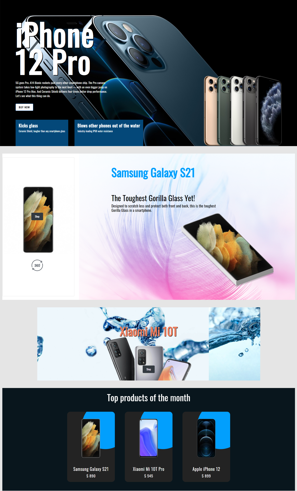
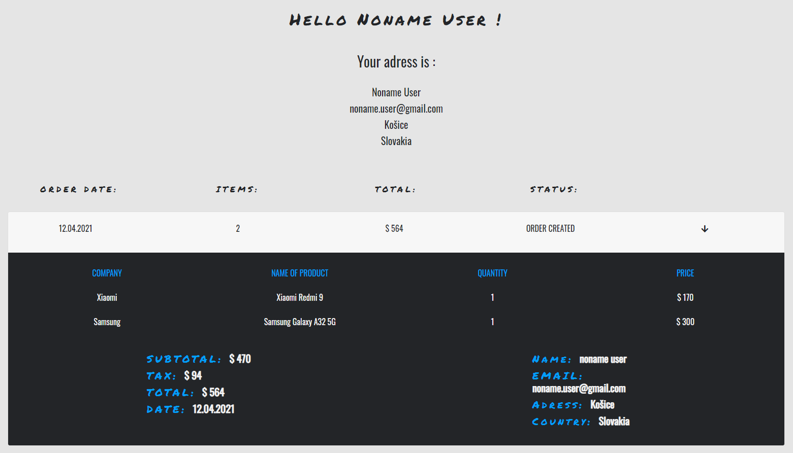
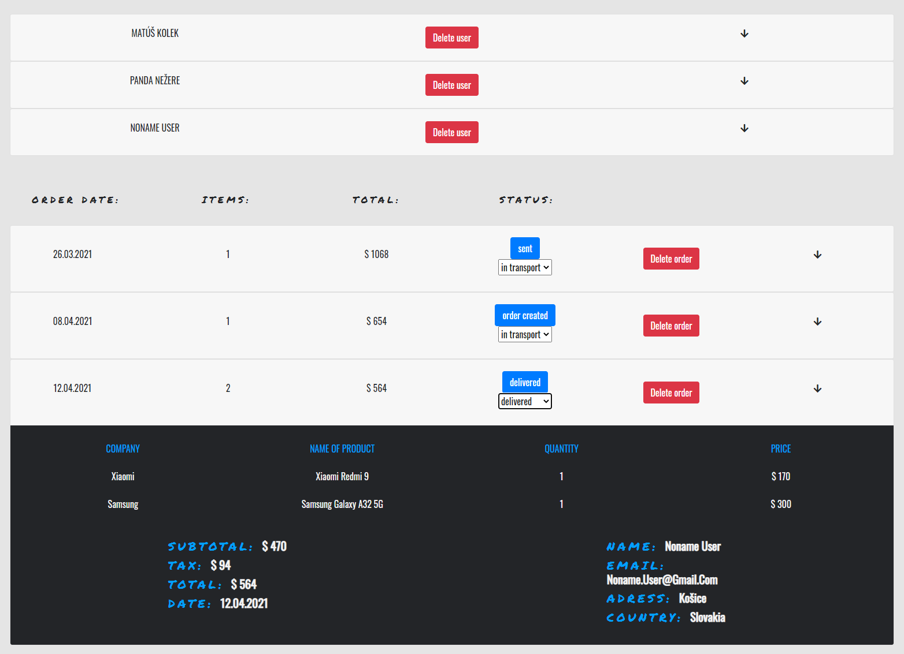
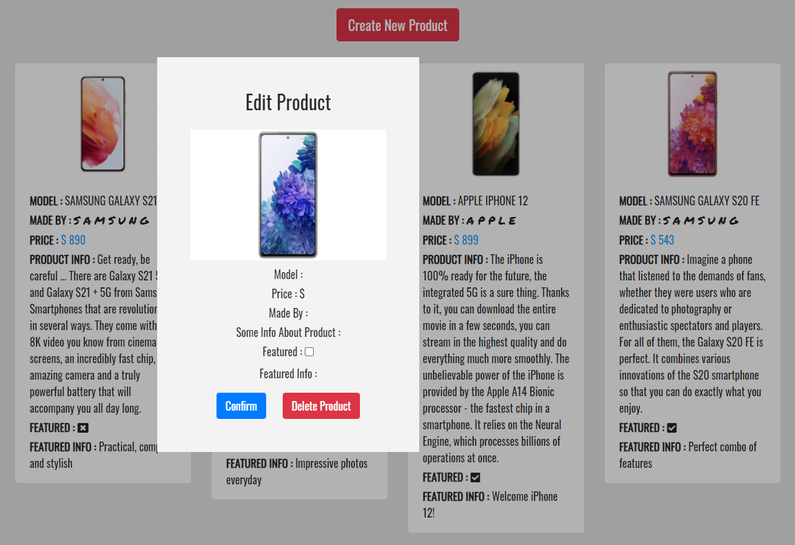
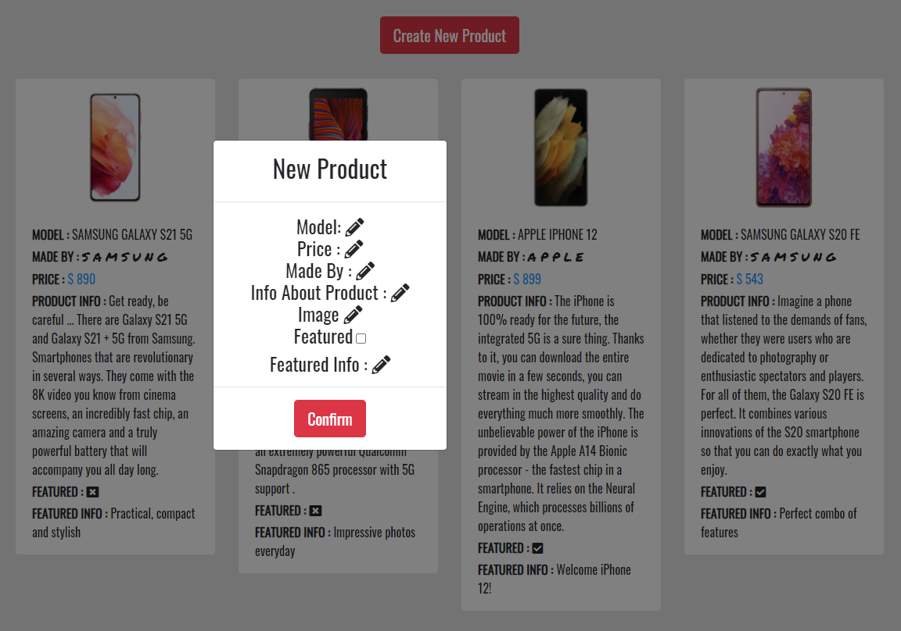

# This is a demonstration of the mobile store e-commerce with admin and user section.

### Type : Full-stack

### Build with :
* React
* Bootstrap
* styled-components
* Node.js
* Express
* Rest API
* MongoDB

### 1. Modern product design with 360° view, hover effects and more.

### 2. User profile => Section with information about the user, his paid orders with details, processing status and delivery address.

### 3. Admin section - Users and Orders => Admin can view all user information, delete their profile, delete and manage each of user's orders depending on processing status.

### 4. Admin section - Products => Admin can view all information of product and delete or edit them.

### 5. Admin section - New Product => Admin can add a new product according to selected parameters.

